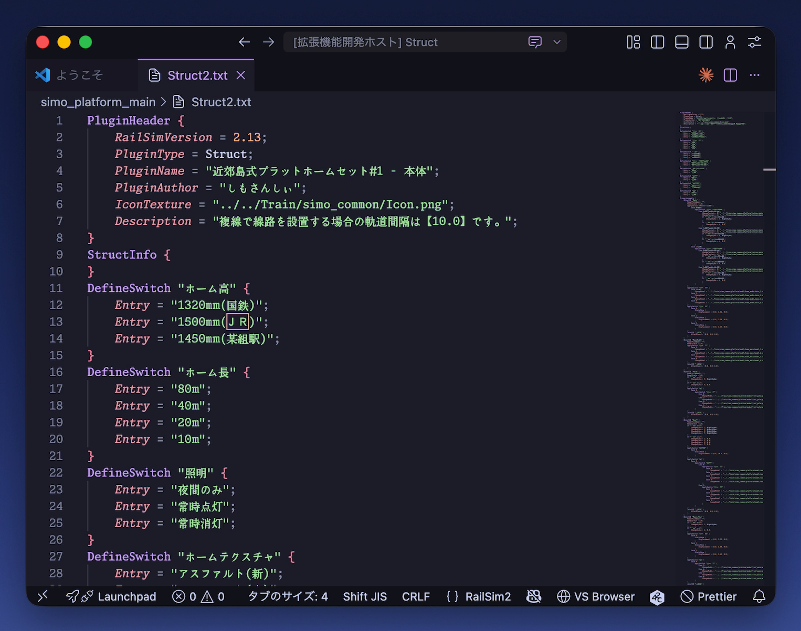
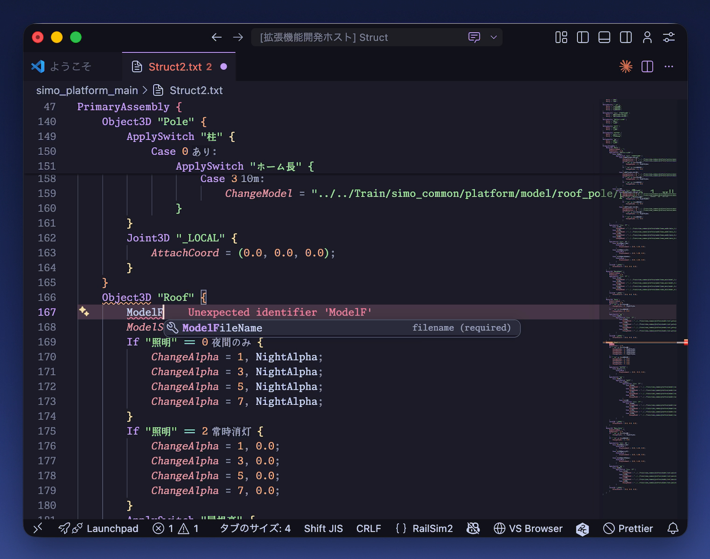
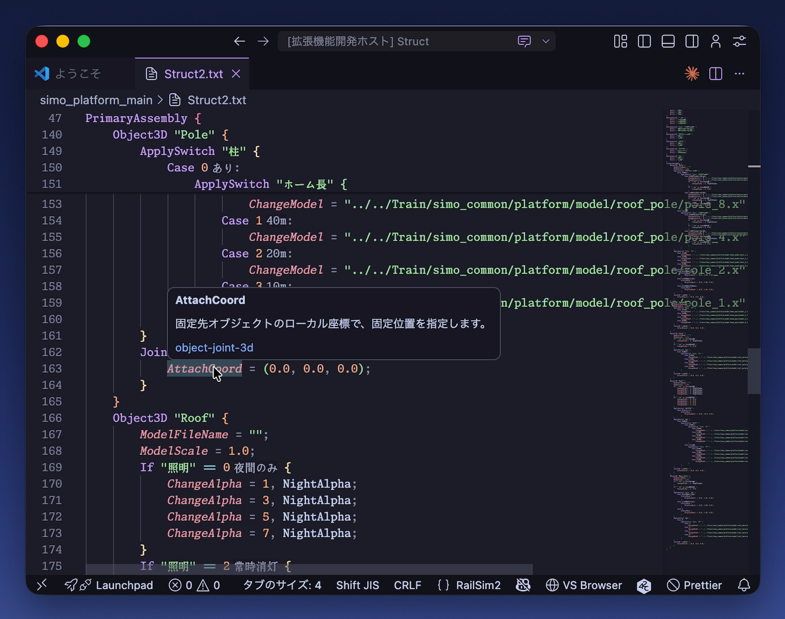
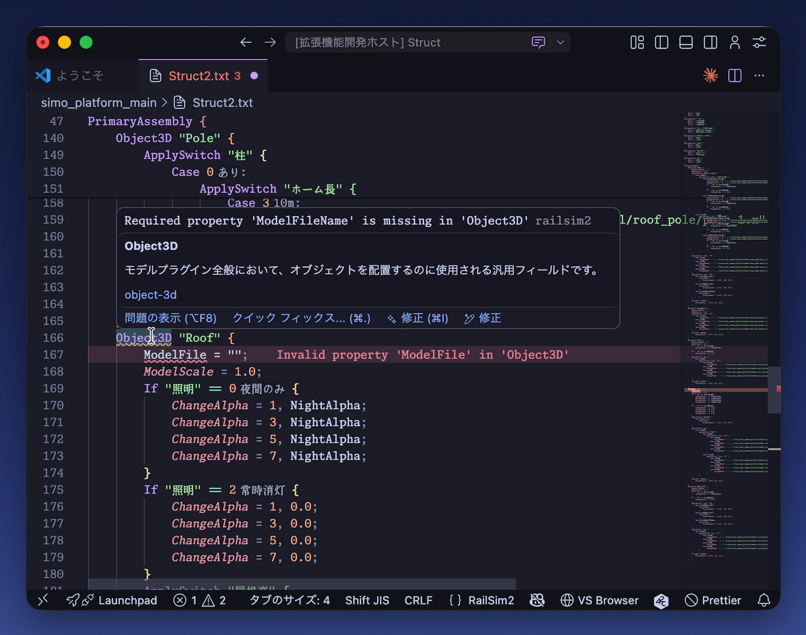
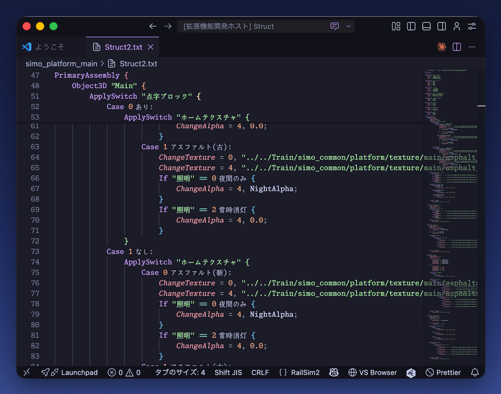

# RailSim2 Support

RailSim2 プラグイン定義ファイルの開発を支援する Visual Studio Code 拡張機能です。

対象のファイル名を開くだけで、キーワードの色分け・入力補完・エラーチェックなどの機能が使えるようになります。

## 対応ファイル

以下のファイル名を開くと、RailSim2 用のファイルとして認識されます。

`Rail2.txt` / `Tie2.txt` / `Girder2.txt` / `Pier2.txt` / `Line2.txt` / `Pole2.txt` / `Train2.txt` / `Station2.txt` / `Struct2.txt` / `Surface2.txt` / `Env2.txt` / `Skin2.txt`

上記以外のファイル名で作業している場合は、VS Code 右下の言語モードから `RailSim2` を選択してください。

## 機能紹介

### シンタックスハイライト

キーワードや数値、文字列、コメントなどを色分けして表示します。

### 入力補完

キーワードやプロパティ名を途中まで入力すると、候補が表示されます。候補を選ぶだけで正しいキーワードを入力できるので、スペルミスを防げます。

### ホバー情報

キーワードやプロパティ名にマウスカーソルを合わせると、説明やヘルプへのリンクが表示されます。

### エラーチェック

ファイルを編集すると、リアルタイムで以下のチェックが行われます。

- **構文エラー** - 括弧の閉じ忘れや書式の間違い
- **不明なキーワード** - 存在しないキーワードの使用
- **プロパティの検証** - 値の種類や個数、指定できる項目の間違い
- **Switch の検証** - Switch の定義や参照の整合性

### フォーマット

ファイル全体のインデントや空白を自動で整えます。VS Code の「ドキュメントのフォーマット」（`Shift+Alt+F`）で実行できます。

### インレイヒント

Switch の Case 番号の横に、対応するラベル名を薄く表示します。

## Shift_JIS でファイルを扱うには

RailSim2 のプラグイン定義ファイルは Shift_JIS（SJIS）で保存する必要があります。VS Code は初期設定では UTF-8 でファイルを開くため、日本語が文字化けすることがあります。

以下の設定で Shift_JIS を扱えるようにしましょう。

### 自動文字コード判定を有効にする

VS Code の設定で、ファイルを開くときに文字コードを自動で判定するようにします。

1. `Ctrl+,`（Mac: `Cmd+,`）で設定を開く
2. 検索欄に `Auto Guess Encoding` と入力する
3. **Files: Auto Guess Encoding** にチェックを入れる

Shift_JIS のファイルを開いたときに、文字化けしにくくなります。

### Shift_JIS で保存する

ファイルを保存するときに文字コードを指定するには、以下の手順で行います。

1. VS Code のウィンドウ下部にあるステータスバーの文字コード表示（例: `UTF-8`）をクリックする
2. **Save with Encoding** を選択する
3. 一覧から **Japanese (Shift JIS)** を選択する

## 対応バージョン

RailSim 2.15 のプラグイン定義ファイルを対象にしています。
RailSim2 -k-build の独自記法には対応していません。

## 不具合・要望

不具合や機能追加の要望は [GitHub Issues](https://github.com/simochee/railsim2-support/issues) または [X @simo_offcl](https://x.com/simo_offcl) へお願いします。

## RailSim2 について

[RailSim2](http://railsim2.net/) は おかづ 氏が開発した鉄道シミュレーターです。RailSim2 本体は [GNU Lesser General Public License v2.1 (LGPL-2.1)](https://www.gnu.org/licenses/old-licenses/lgpl-2.1.html) のもとで公開されています。

この拡張機能は RailSim2 本体とは独立した非公式のツールであり、[MIT License](https://opensource.org/licenses/MIT) のもとで公開されています。RailSim2 本体の開発者とは関係ありません。
